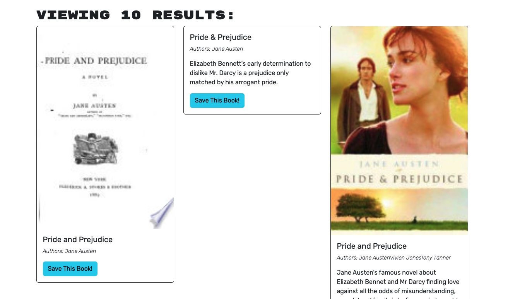

# Homework 21 - Book Search Engine

## Description

This repository contains a book search engine application that allows users to search for books, create an account, log in, save books to their account, and manage their saved books.

## Table of Contents

- [License](#license)
- [Installation](#installation)
- [Usage](#usage)
- [Contributing](#contributing)
- [Additional Information](#additional-information)

## License

This project has no license.

## Installation

Using the provided Heroku link, the portfolio will be fully functional in a web browser.

To use the files from the repository, you will need to have Node.js installed on your computer. Once Node.js is installed, you can download the files from the GitHub repository and run the following command in the terminal:

```
npm install
```

This command will install all the necessary dependencies required to run the portfolio. 

## Usage

The book search engine provides the following functionalities:

- When the search engine is loaded, the user is presented with a menu that includes the options "Search for Books" and "Login/Signup," an input field to search for books, and a submit button.
- Clicking on the "Search for Books" menu option displays an input field to search for books and a submit button.
- If the user is not logged in and performs a search by entering a search term in the input field and clicking the submit button, several search results are presented. Each result includes a book's title, author, description, image, and a link to that book on the Google Books site.
- Clicking on the "Login/Signup" menu option opens a modal on the screen with a toggle between the options to log in or sign up.
- If the toggle is set to "Signup," the user is presented with three inputs for a username, an email address, and a password, as well as a signup button.
- If the toggle is set to "Login," the user is presented with two inputs for an email address and a password, as well as a login button.
- If the user enters a valid email address, creates a password, and clicks on the signup button, their user account is created, and they are logged in to the site.
- If the user enters their account's email address and password and clicks on the login button, the modal closes, and they are logged in to the site.
- When the user is logged in to the site, the menu options change to "Search for Books," an option to view their saved books, and "Logout."
- If the user is logged in and performs a search by entering a search term in the input field and clicking the submit button, several search results are presented. Each result includes a book's title, author, description, image, a link to that book on the Google Books site, and a button to save the book to their account.
- Clicking on the "Save" button on a book saves that book's information to the user's account.
- Clicking on the option to view their saved books presents the user with all the books they have saved to their account. Each saved book includes the book's title, author, description, image, a link to that book on the Google Books site, and a button to remove the book from their account.
- Clicking on the "Remove" button on a book deletes that book from the user's saved books list.
- Clicking on the "Logout" button logs the user out of the site and presents them with a menu containing the options "Search for Books" and "Login/Signup," an input field to search for books, and a submit button.

Here are images of the sites in use:

- Homepage:


- Search Results:


- Sign Up:


- Log In:


- Save Book Button:


- Saved Book Library:


## Contributing

Thank you to our instructor Bryan for providing the starter code and and our TA Shawn for all his help and guidance.

## Additional Information

GitHub Repository: https://github.com/JasperJackalope/book-search-engine

Heroku Link: